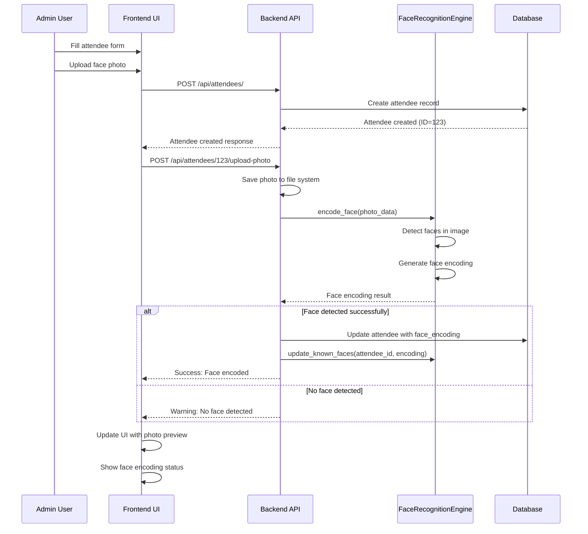
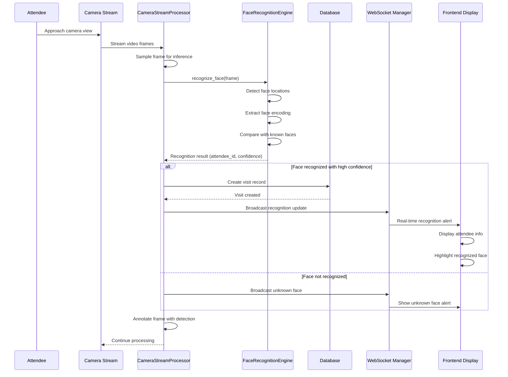
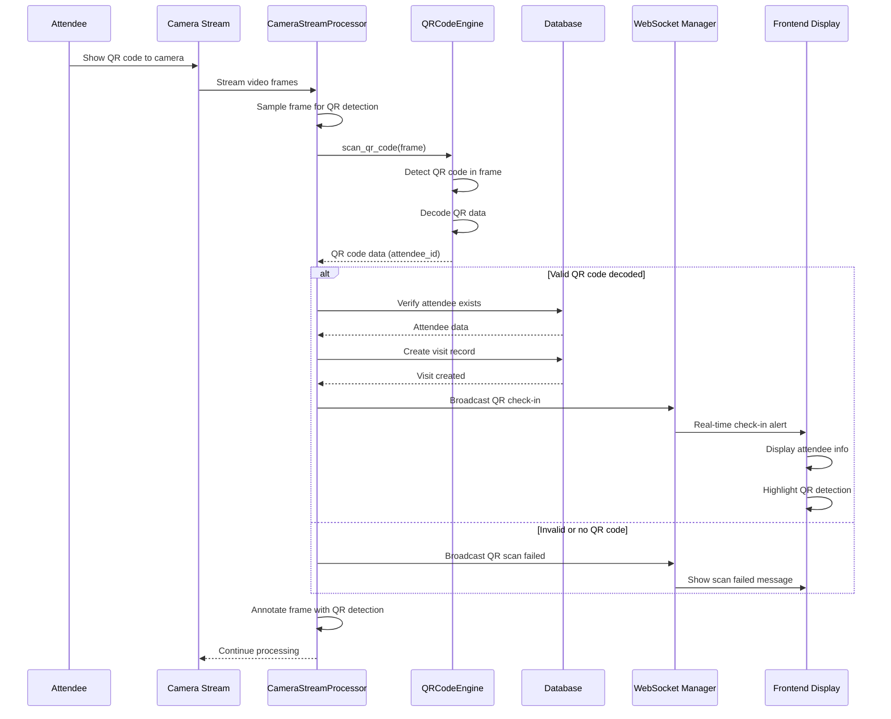
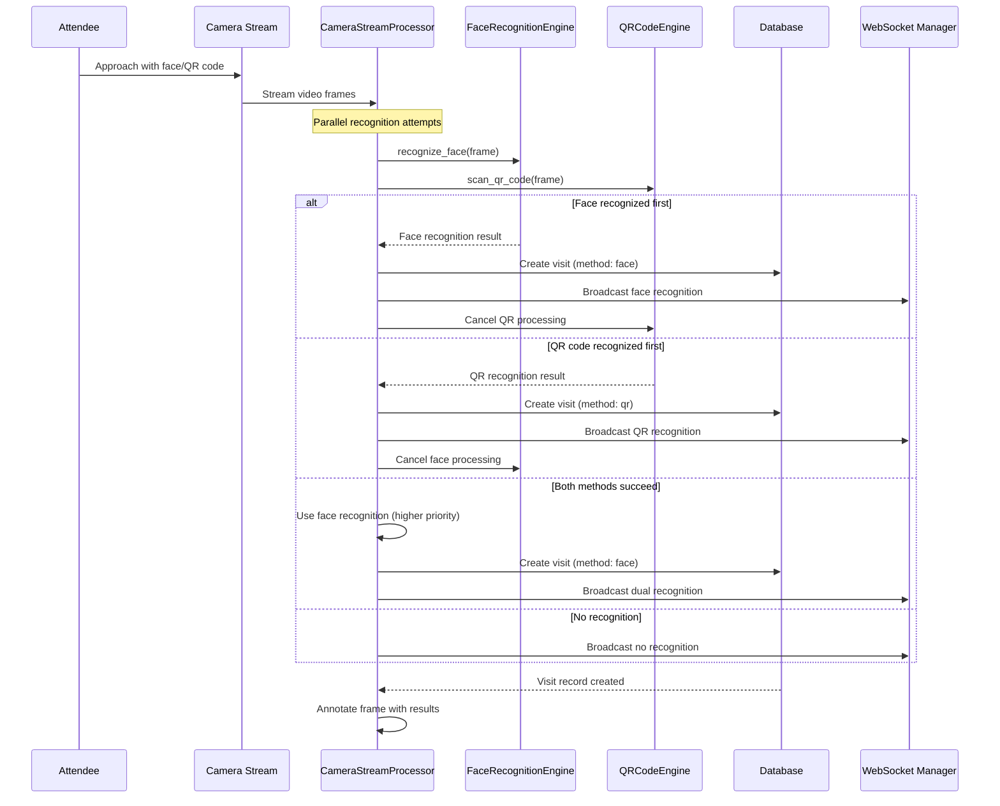
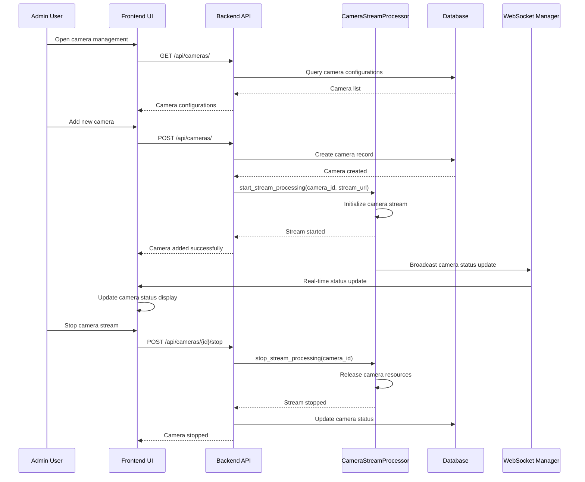
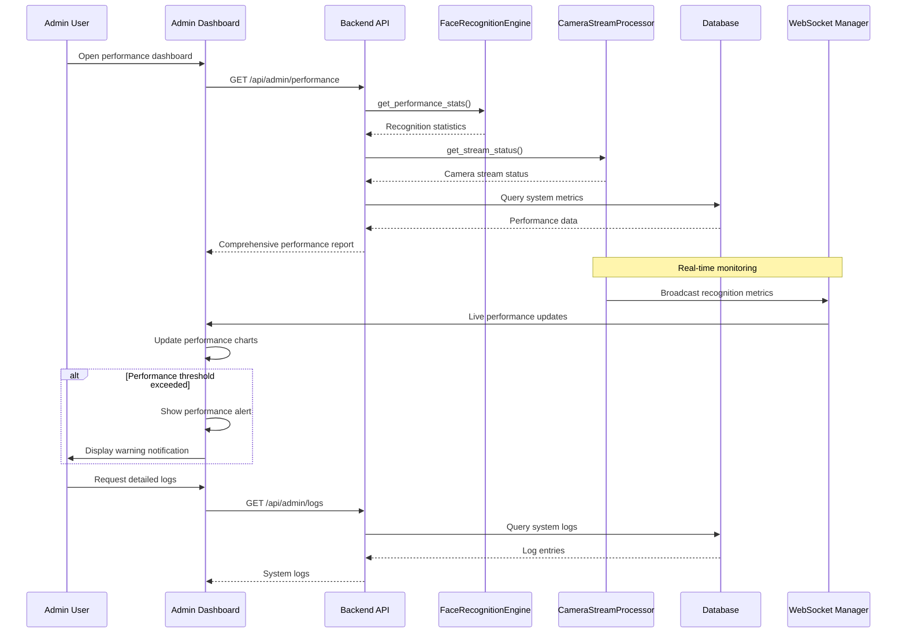

# VIP Reception System - UML Sequence Diagrams

## Key Business Use Cases

### Use Case 1: Attendee Registration with Face Photo Upload

**Description**: Register a new attendee and upload their face photo for recognition encoding.

**Actors**: Admin User, System

**Preconditions**: 
- Admin is logged into the system
- Camera system is operational

**Postconditions**:
- Attendee is registered in the database
- Face encoding is generated and stored
- Photo is saved for display

### Use Case 2: Real-time Face Recognition at Entry Point

**Description**: Recognize attendee via face recognition when they approach the exhibition entry.

**Actors**: Attendee, Camera System, System

**Preconditions**:
- Camera is active and streaming
- Attendee has registered face encoding
- System is running real-time recognition

**Postconditions**:
- Attendee is recognized and checked in
- Visit record is created
- Real-time notification is sent

### Use Case 3: QR Code Check-in Process

**Description**: Attendee checks in using QR code displayed on their mobile device or badge.

**Actors**: Attendee, Camera System, System

**Preconditions**:
- Attendee has valid QR code
- Camera is active and streaming
- QR code scanning is enabled

**Postconditions**:
- Attendee is checked in via QR code
- Visit record is created
- Real-time notification is sent

### Use Case 4: Dual Recognition Fallback Process

**Description**: System attempts both face recognition and QR code scanning, using the first successful method.

**Actors**: Attendee, Camera System, System

**Preconditions**:
- Camera is active and streaming
- Both recognition methods are enabled
- Attendee may have face encoding and/or QR code

**Postconditions**:
- Attendee is recognized by either method
- Visit record is created
- System logs which method was successful

### Use Case 5: Camera Stream Management

**Description**: Admin configures and manages camera streams for the recognition system.

**Actors**: Admin User, System

**Preconditions**:
- Admin is logged into the system
- Camera hardware is available

**Postconditions**:
- Camera configuration is saved
- Stream processing is started/stopped
- System status is updated

### Use Case 6: System Performance Monitoring

**Description**: System administrator monitors recognition performance and system health.

**Actors**: Admin User, System

**Preconditions**:
- Admin is logged into admin dashboard
- System is operational with active cameras

**Postconditions**:
- Performance statistics are displayed
- System health status is updated
- Alerts are generated for issues

## Key System Interactions Summary

1. **Registration Flow**: Admin → Frontend → Backend → Database → Face Engine
2. **Recognition Flow**: Camera → Processor → Recognition Engine → Database → WebSocket → Frontend
3. **Management Flow**: Admin → Frontend → Backend → Processor → Database
4. **Monitoring Flow**: Admin → Frontend → Backend → System Components → Real-time Updates

These sequence diagrams illustrate the core business processes and system interactions that make the VIP Reception System functional and efficient for aviation exhibition management.
