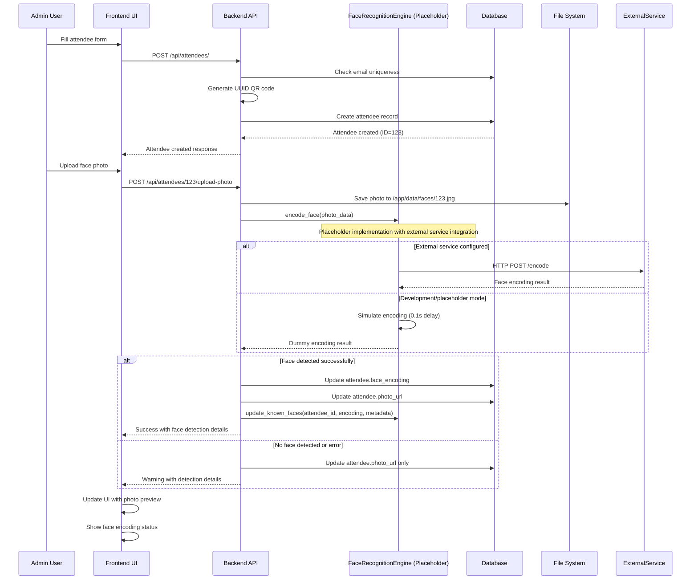
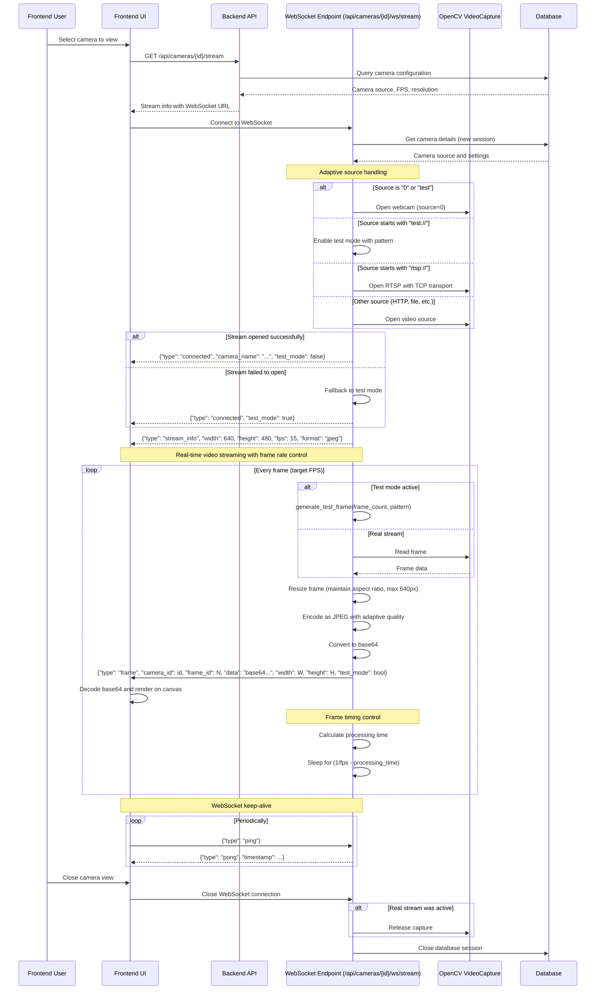
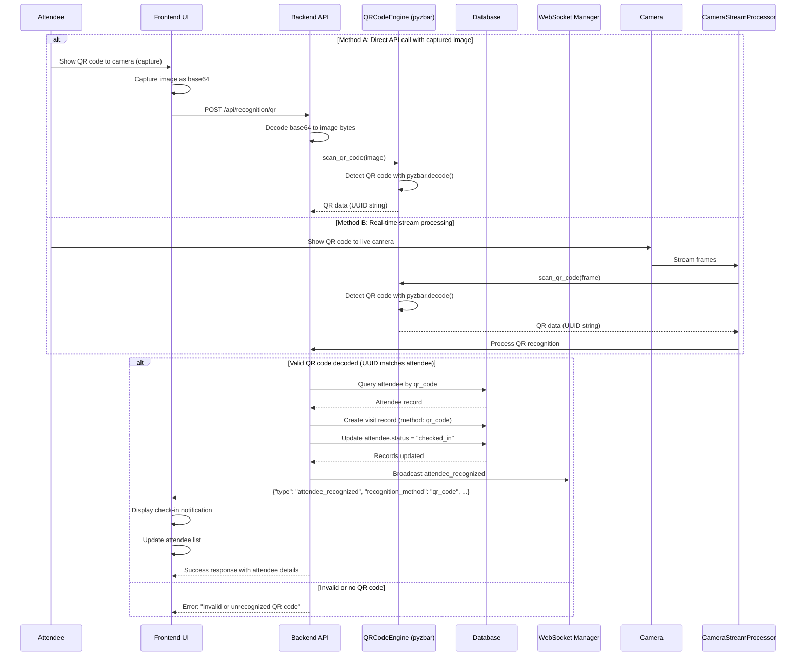
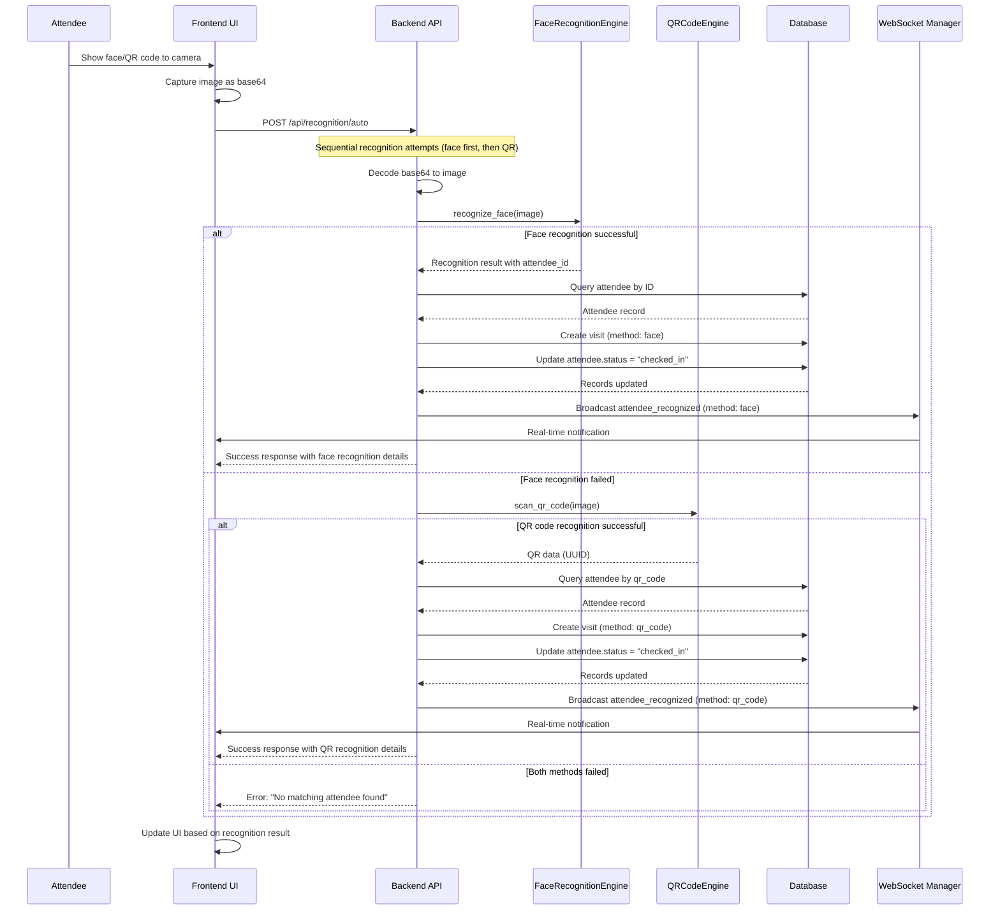
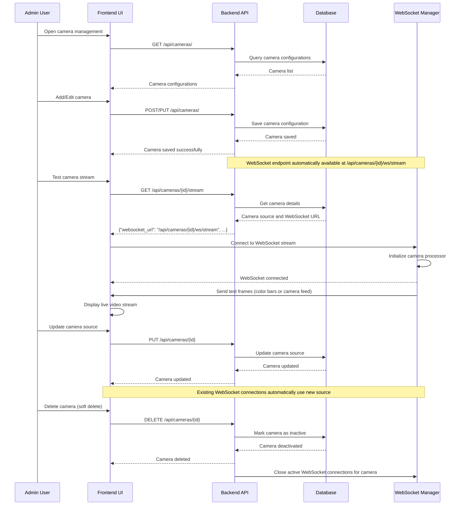
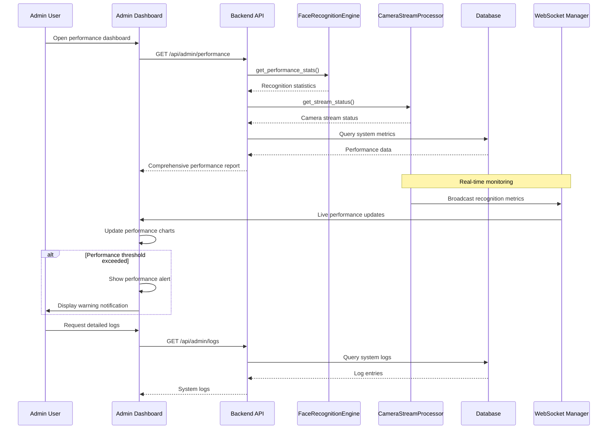

# VIP Reception System - UML Sequence Diagrams

## Key Business Use Cases

### Use Case 1: Attendee Registration with Face Photo Upload

**Description**: Register a new attendee and upload their face photo for recognition encoding using placeholder engine with external service integration capability.

**Actors**: Admin User, System

**Preconditions**: 
- Admin is logged into the system
- Face recognition engine is initialized (placeholder mode)

**Postconditions**:
- Attendee is registered in the database with QR code
- Photo is saved to `/app/data/faces/{attendee_id}.jpg`
- Face encoding is attempted (placeholder/dummy encoding for development)
- Face cache is updated for external service integration

### Use Case 2: Real-time Camera Streaming with WebSocket

**Description**: Stream live camera video via WebSocket with adaptive source handling (test patterns, webcam, RTSP, HTTP) and frame rate control.

**Actors**: Frontend User, Camera System, System

**Preconditions**:
- Camera is configured in database with source URL
- Backend WebSocket server is running
- Frontend can connect to backend WebSocket

**Postconditions**:
- WebSocket connection established with stream info
- Live video frames streamed at target FPS (default 15fps)
- Adaptive JPEG quality based on frame size
- Test mode fallback if real stream fails

### Use Case 3: QR Code Check-in Process

**Description**: Attendee checks in using QR code via API endpoint or real-time camera stream processing.

**Actors**: Attendee, Camera System, System

**Preconditions**:
- Attendee has valid QR code (UUID generated during registration)
- Camera is active and streaming (for real-time) OR image can be captured
- QR code scanning is enabled via pyzbar library

**Postconditions**:
- Attendee is checked in via QR code
- Visit record is created with method "qr_code"
- Attendee status updated to "checked_in"
- Real-time WebSocket notification sent to frontend

### Use Case 4: Dual Recognition Fallback Process

**Description**: System attempts both face recognition and QR code scanning sequentially via /api/recognition/auto endpoint, using the first successful method.

**Actors**: Attendee, Camera System, System

**Preconditions**:
- Image can be captured (base64 encoded)
- Both recognition methods are available
- Attendee may have face encoding and/or QR code

**Postconditions**:
- Attendee is recognized by either method (face first, then QR)
- Visit record is created with successful method
- Attendee status updated to "checked_in"
- Real-time WebSocket notification sent

### Use Case 5: Camera Stream Management with WebSocket

**Description**: Admin configures and manages camera streams with WebSocket-based video streaming.

**Actors**: Admin User, System

**Preconditions**:
- Admin is logged into the system
- Camera is configured with source (test://, RTSP, HTTP, or webcam)

**Postconditions**:
- Camera configuration is saved to database
- WebSocket streaming endpoint is available
- Frontend can connect to stream camera video

### Use Case 6: System Performance Monitoring

**Description**: System administrator monitors recognition performance and system health.

**Actors**: Admin User, System

**Preconditions**:
- Admin is logged into admin dashboard
- System is operational with active cameras

**Postconditions**:
- Performance statistics are displayed
- System health status is updated
- Alerts are generated for issues

## Key System Interactions Summary

1. **Registration Flow**: Admin → Frontend → Backend → Database (with QR generation) → File System (photo storage) → Face Recognition Engine (placeholder with external service integration)
2. **Video Streaming Flow**: Frontend → Backend → WebSocket Endpoint → OpenCV VideoCapture → Adaptive Frame Processing → Frontend Canvas Rendering
3. **Recognition Flow**: 
   - **Face**: Frontend → Backend → FaceRecognitionEngine (placeholder) → Database (visit creation) → WebSocket Broadcast
   - **QR Code**: Frontend → Backend → QRCodeEngine (pyzbar) → Database (attendee lookup) → Visit Creation → WebSocket Broadcast
   - **Auto**: Sequential attempt of face then QR with fallback
4. **Camera Management Flow**: Admin → Frontend → Backend → Database (CRUD operations) → Automatic WebSocket endpoint generation
5. **Monitoring Flow**: Admin Dashboard → Backend API → System Components (FaceEngine, CameraStreamProcessor) → Database Metrics → Real-time WebSocket Updates

### Current Implementation Architecture:

#### **WebSocket Video Streaming**:
- **Endpoint**: `/api/cameras/{id}/ws/stream` with connection management via `ConnectionManager`
- **Frame Processing**: Adaptive JPEG encoding with quality based on frame size, target FPS control (default 15fps)
- **Source Handling**: Supports webcam (source=0), RTSP (with TCP transport), HTTP streams, and test patterns (`test://color_bars`, `test://default`)
- **Fallback Mechanism**: Automatic switch to test mode if real stream fails to open
- **Frame Timing**: Dynamic sleep calculation to maintain consistent frame rate

#### **Recognition Engine Architecture**:
- **FaceRecognitionEngine**: Placeholder implementation with external service integration hooks
  - `encode_face()`: Simulates encoding (0.1s delay) or calls external service if configured
  - `recognize_face()`: Returns dummy results for demo (attendee_id=1, confidence=0.85)
  - External service integration via HTTP POST to configured endpoint
- **QRCodeEngine**: Functional implementation using `pyzbar` library
  - `scan_qr_code()`: Detects and decodes QR codes from images
  - Supports UUID QR codes generated during attendee registration
- **CameraStreamProcessor**: Real-time processing with parallel face and QR recognition
  - Processes frames every 10 frames for performance
  - Annotates frames with detection rectangles
  - Sends recognition updates via WebSocket

#### **Database Integration**:
- **Attendee Management**: Full CRUD with email uniqueness validation, QR code generation (UUID)
- **Visit Tracking**: Automatic visit record creation on successful recognition
- **Status Management**: Attendee status updates ("checked_in", "checked_out")
- **Photo Storage**: Files saved to `/app/data/faces/{attendee_id}.jpg` with serving endpoint

#### **API Endpoints**:
- **Cameras**: `/api/cameras/` - CRUD operations, stream info, WebSocket streaming
- **Recognition**: `/api/recognition/face`, `/api/recognition/qr`, `/api/recognition/auto` - recognition endpoints
- **Attendees**: `/api/attendees/` - CRUD, photo upload, visit history, check-out
- **Admin**: `/api/admin/` - performance monitoring, system logs

These sequence diagrams accurately reflect the current implementation of the VIP Reception System, showing both the placeholder/demo components ready for external service integration and the fully functional components (QR code scanning, WebSocket streaming, database management).
