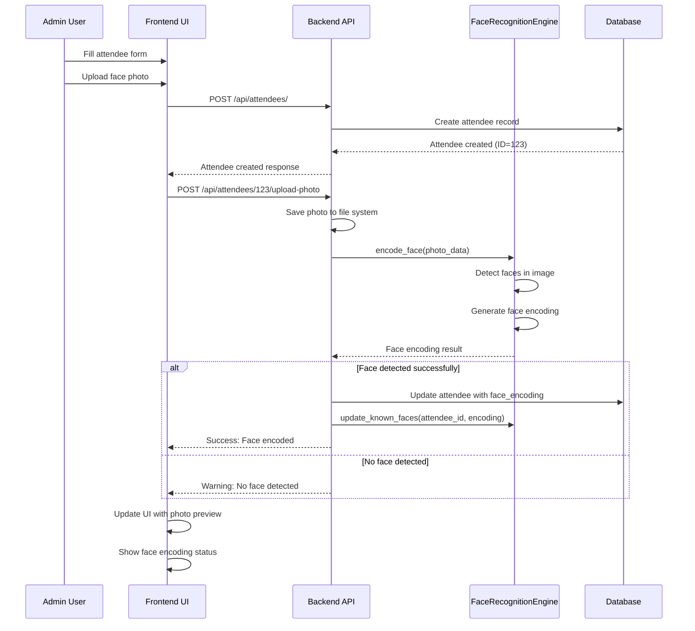
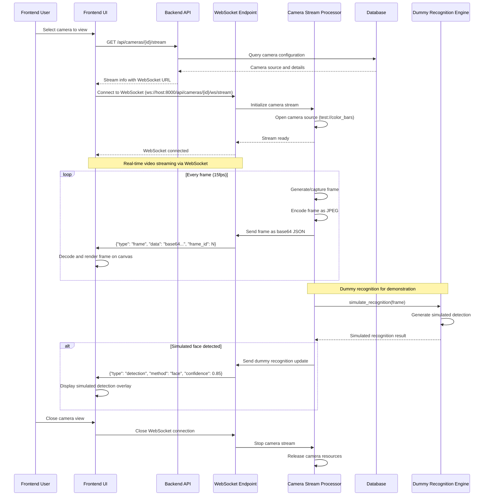
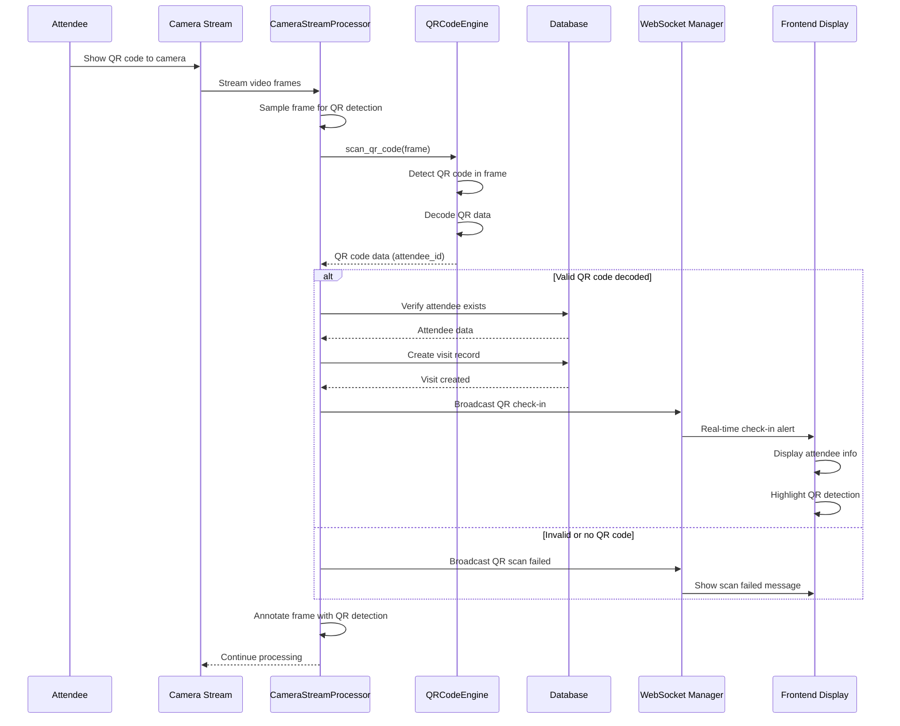
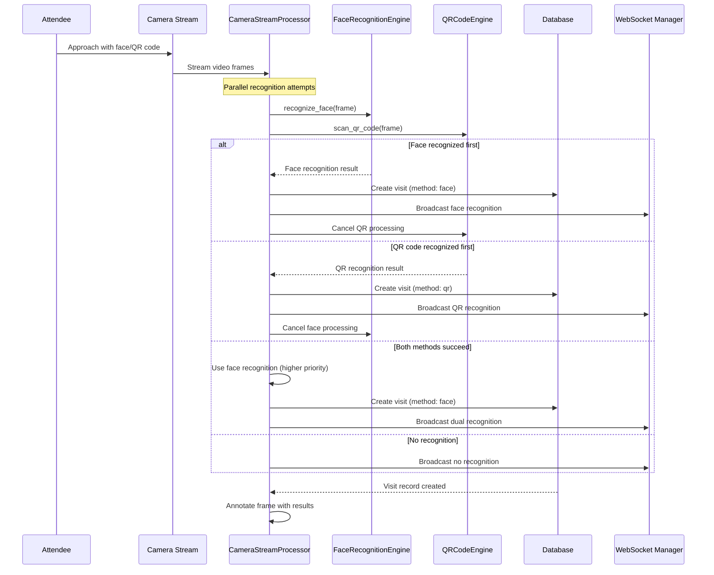
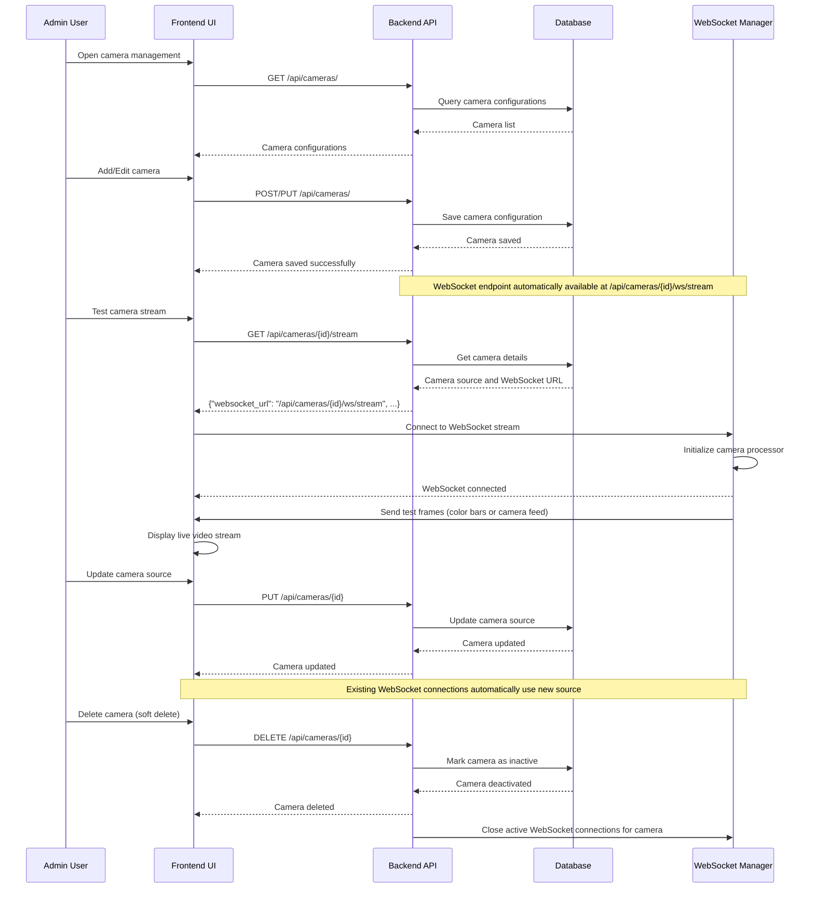
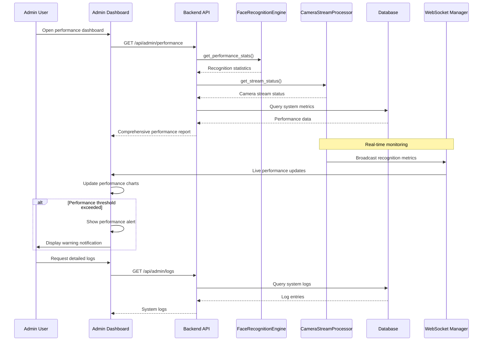

# VIP Reception System - UML Sequence Diagrams

## Key Business Use Cases

### Use Case 1: Attendee Registration with Face Photo Upload

**Description**: Register a new attendee and upload their face photo for recognition encoding.

**Actors**: Admin User, System

**Preconditions**: 
- Admin is logged into the system
- Camera system is operational

**Postconditions**:
- Attendee is registered in the database
- Face encoding is generated and stored
- Photo is saved for display

### Use Case 2: Real-time Camera Streaming with WebSocket

**Description**: Stream live camera video via WebSocket for real-time display with dummy recognition placeholder.

**Actors**: Frontend User, Camera System, System

**Preconditions**:
- Camera is configured in database
- Backend WebSocket server is running
- Frontend can connect to backend WebSocket

**Postconditions**:
- WebSocket connection established
- Live video frames streamed to frontend
- Dummy recognition results simulated for demonstration

### Use Case 3: QR Code Check-in Process

**Description**: Attendee checks in using QR code displayed on their mobile device or badge.

**Actors**: Attendee, Camera System, System

**Preconditions**:
- Attendee has valid QR code
- Camera is active and streaming
- QR code scanning is enabled

**Postconditions**:
- Attendee is checked in via QR code
- Visit record is created
- Real-time notification is sent

### Use Case 4: Dual Recognition Fallback Process

**Description**: System attempts both face recognition and QR code scanning, using the first successful method.

**Actors**: Attendee, Camera System, System

**Preconditions**:
- Camera is active and streaming
- Both recognition methods are enabled
- Attendee may have face encoding and/or QR code

**Postconditions**:
- Attendee is recognized by either method
- Visit record is created
- System logs which method was successful

### Use Case 5: Camera Stream Management with WebSocket

**Description**: Admin configures and manages camera streams with WebSocket-based video streaming.

**Actors**: Admin User, System

**Preconditions**:
- Admin is logged into the system
- Camera is configured with source (test://, RTSP, HTTP, or webcam)

**Postconditions**:
- Camera configuration is saved to database
- WebSocket streaming endpoint is available
- Frontend can connect to stream camera video

### Use Case 6: System Performance Monitoring

**Description**: System administrator monitors recognition performance and system health.

**Actors**: Admin User, System

**Preconditions**:
- Admin is logged into admin dashboard
- System is operational with active cameras

**Postconditions**:
- Performance statistics are displayed
- System health status is updated
- Alerts are generated for issues

## Key System Interactions Summary

1. **Registration Flow**: Admin → Frontend → Backend → Database → Face Engine (Dummy)
2. **Video Streaming Flow**: Frontend → Backend → WebSocket → Camera Processor → Frame Generation → Frontend Display
3. **Camera Management Flow**: Admin → Frontend → Backend → Database → WebSocket Configuration
4. **Monitoring Flow**: Admin → Frontend → Backend → System Components → Real-time Updates

### Updated Architecture Highlights:

#### **WebSocket Video Streaming**:
- **Connection**: Frontend connects to `ws://host:8000/api/cameras/{id}/ws/stream`
- **Frame Transmission**: JPEG frames as base64 in JSON messages
- **Real-time Display**: Canvas-based rendering with smooth 30fps processing
- **LAN Access**: Dynamic host resolution for cross-device accessibility

#### **Dummy Recognition Implementation**:
- **Face Recognition**: Simulated results for demonstration
- **QR Code Scanning**: Placeholder for future integration
- **Interface Preservation**: Maintains API for easy external service integration

#### **Camera Source Support**:
- **Test Patterns**: `test://color_bars`, `test://default` for development
- **Real Cameras**: Webcam (source=0), RTSP, HTTP streams
- **Fallback**: Automatic switch to test mode on stream failure

These sequence diagrams illustrate the core business processes and system interactions that make the VIP Reception System functional and efficient for aviation exhibition management with WebSocket-based video streaming and ready-for-integration recognition architecture.
